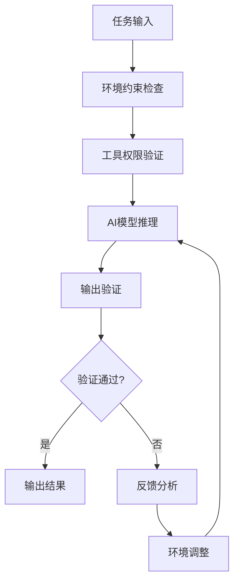
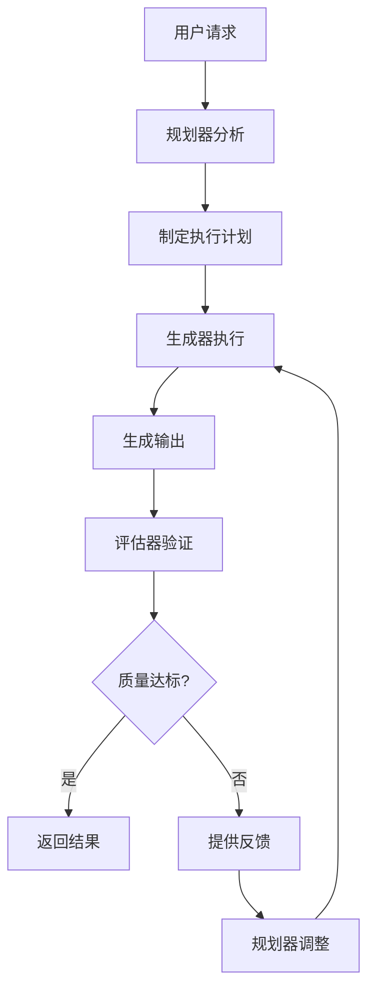

# Harness Engineering 深度研究报告

- 研究日期：2026/04/15
- 研究深度：访问 35+ 个页面，检索 40+ 条查询

## 摘要

Harness Engineering（中文常译为"驾驭工程"或"约束工程"）是2026年初兴起的一种AI工程新范式，专注于为AI智能体设计和构建完整的约束机制、反馈循环、工作流控制和持续改进循环的系统化工程实践。与之前的Prompt Engineering（提示工程）和Context Engineering（上下文工程）不同，Harness Engineering关注的是构建整个AI代理的运行环境和控制系统，确保可靠、一致和可维护的输出。

该概念由HashiCorp联合创始人Mitchell Hashimoto于2026年2月5日首次提出，随后OpenAI在2026年2月11日发布的实验报告极大地推广了这一概念，展示了其在生产环境中的实际应用价值。Harness Engineering代表了AI工程范式的第三次演进，标志着从优化单个AI交互转向构建完整的、可靠的AI智能体操作系统。

## 出品方与维护组织

### 出品方/提出者

- **首次提出者**：**Mitchell Hashimoto**（HashiCorp联合创始人，Terraform、Vagrant等工具的创造者）
  - **提出时间**：2026年2月5日
  - **提出平台**：个人博客文章《My AI Adoption Journey》([mitchellh.com](https://mitchellh.com/writing/my-ai-adoption-journey))
  - **原始定义**："Harness engineering is the idea that anytime you find an agent makes a mistake, you take the time to engineer a solution such that the agent will not make that mistake again in the future."

### 关键推广组织

- **OpenAI**：2026年2月11日发布《Harness engineering: leveraging Codex in an agent-first world》([app.daily.dev](https://app.daily.dev/posts/harness-engineering-leveraging-codex-in-an-agent-first-world-py6m8jwm4))，详细描述了3名工程师在5个月内使用Codex Agent生成超过100万行生产代码的实验
- **Anthropic**：开发了三智能体架构（规划器、生成器、评估器），在Claude Code中实践了Harness Engineering理念
- **LangChain**：通过优化harness设计，将编码智能体性能从Terminal Bench 2.0的前30名提升到前5名
- **Thoughtworks**：Birgitta Böckeler于2026年2月17日在Martin Fowler网站上发表了系统分析，提出了公式：**Agent = Model + Harness**

### 维护与发展

Harness Engineering作为一个工程学科，目前由多个AI公司和技术社区共同发展和维护：
- **开源社区**：多个GitHub仓库如harness-engineering、harness-books、learn-harness-engineering等
- **行业联盟**：OpenAI、Anthropic、LangChain等公司各自有不同的实现和最佳实践
- **学术研究**：arXiv上有相关论文如"SemaClaw: A Step Towards General-Purpose Personal AI Agents through Harness Engineering"

## 最早提出时间

### 时间线

- **2026年2月5日**：Mitchell Hashimoto在其个人博客中首次提出"Harness Engineering"概念，定义了核心思想
- **2026年2月11日**：OpenAI发布实验报告，展示了在5个月内用AI生成100万行生产代码的极端Harness Engineering实践
- **2026年2月17日**：Thoughtworks的Birgitta Böckeler发表系统分析，提出了"Agent = Model + Harness"的公式
- **2026年3-4月**：Anthropic发布了多篇论文并推出了Claude Managed Agents，进一步发展和完善了Harness Engineering概念
- **2026年4月13日**：SemaClaw论文提交到arXiv，提出了通过Harness Engineering实现通用个人AI代理的框架

### 概念演进历程

Harness Engineering代表了AI工程范式的三次演进：

1. **Prompt Engineering（2023-2024）**：关注"如何与模型对话" - 设计指令、示例、格式
2. **Context Engineering（2024-2025）**：关注"模型应该看到什么" - 管理上下文窗口、知识库、记忆
3. **Harness Engineering（2025-2026）**：关注"整个环境应该如何运作" - 设计完整的执行环境，包含约束、反馈循环、验证和治理

## 诞生背景

### AI代理发展的瓶颈

在Harness Engineering出现之前，AI代理开发面临多个瓶颈：

1. **可靠性问题**：AI模型在复杂任务中表现不稳定，难以在生产环境中信任
2. **上下文管理挑战**：长时运行任务中的上下文丢失和漂移问题
3. **安全与合规风险**：未经约束的AI可能产生不安全或不合规的输出
4. **规模化困难**：从实验性原型到生产系统的过渡缺乏系统化方法
5. **协作复杂性**：多代理协作缺乏标准化的协调和通信机制

### 现有方案的不足

- **Prompt Engineering**：只能优化单次交互，无法解决系统性可靠性问题
- **Context Engineering**：改善了信息提供，但未解决执行环境的设计问题
- **传统软件工程方法**：为人类开发者设计，不适用于AI代理的工作方式

### 技术推动因素

1. **模型能力跨越临界点**：AI模型（如GPT-4、Claude 3）已经能够完成有用工作，但不够稳定以自主信任
2. **企业采用需求**：需要可靠、安全、合规的自动化系统
3. **成本压力**：AI推理成本需要更高效的执行环境来优化
4. **竞争态势**：随着模型能力的趋同，工程环境成为新的竞争壁垒

## 解决的核心问题

Harness Engineering旨在解决以下核心问题：

1. **可靠性工程**：确保AI代理在长时间运行和复杂任务中保持稳定输出
2. **状态持久化**：解决AI模型的无状态特性，实现跨会话状态管理
3. **反馈循环设计**：构建自动化验证、评估和改进机制
4. **安全与合规**：实施机械化的约束和边界，防止不安全或不合规行为
5. **多代理协调**：设计有效的多代理协作和通信机制
6. **成本优化**：通过环境设计减少不必要的token消耗和推理成本
7. **可观测性**：提供对AI代理行为的监控、跟踪和调试能力
8. **规模化部署**：支持从单个代理到大规模代理集群的管理

## 适用场景

### 1. 生产级AI代码生成
- **OpenAI案例**：3名工程师在5个月内构建了约100万行代码的产品，零人工编写代码
- **适用项目**：新项目开发、代码重构、自动化测试生成

### 2. 复杂业务流程自动化
- **多步骤工作流**：需要多个AI代理协作的复杂业务流程
- **长时间运行任务**：跨越数小时或数天的自动化任务

### 3. 敏感领域应用
- **金融合规**：需要严格遵守监管要求的自动化系统
- **医疗诊断辅助**：需要高可靠性和可追溯性的AI辅助系统
- **安全关键系统**：任何失败都可能造成严重后果的自动化系统

### 4. 大规模AI代理部署
- **企业级AI助手**：为整个组织部署的AI助手系统
- **客户服务自动化**：需要处理大量并发请求的AI客服系统

### 5. 研究与实验平台
- **AI行为研究**：研究AI模型在不同环境中的行为模式
- **新算法验证**：测试新的AI算法在受控环境中的表现

## 不适用场景

### 1. 简单一次性任务
- **简单查询**：单次问答、简单文本生成等不需要复杂环境的任务
- **原型验证**：快速验证概念的原型阶段，过度工程化会拖慢进度

### 2. 资源极度受限环境
- **边缘计算**：计算资源极其有限的边缘设备
- **实时性要求极高**：需要亚秒级响应的应用场景

### 3. 创意探索性任务
- **艺术创作**：需要高度创造性和不可预测性的艺术创作
- **开放式研究**：探索未知领域的开放式研究任务

### 4. 模型能力验证阶段
- **新模型评估**：评估新模型基础能力时，应避免环境干扰
- **基准测试**：标准化的模型性能基准测试

### 5. 团队技术能力不足
- **缺乏AI工程经验**：团队缺乏AI系统设计和维护经验
- **资源投入不足**：无法承担Harness Engineering的持续维护成本

## 与同类产品/方法论的对比

| 维度 | Harness Engineering | Prompt Engineering | Context Engineering | LangChain框架 | AutoGPT框架 |
|------|---------------------|--------------------|---------------------|---------------|-------------|
| **出品方** | Mitchell Hashimoto (HashiCorp) + OpenAI | 社区演化 | 社区演化 | Harrison Chase (LangChain) | Significant Gravitas Ltd. |
| **首次提出** | 2026年2月5日 | 2022-2023年 | 2024-2025年 | 2022年10月 | 2023年3月 |
| **核心理念** | 设计完整的AI代理运行环境和控制系统 | 优化单次交互的提示设计 | 优化AI看到的信息和上下文 | 构建LLM应用的开发框架 | 自主AI代理框架 |
| **关注焦点** | 整个执行环境：约束、反馈、治理 | 单次提示的质量和效果 | 上下文信息的组织和管理 | 工具链和组件集成 | 任务自动化和自主执行 |
| **技术栈** | 多代理架构、状态管理、验证系统 | 提示模板、少量示例 | RAG、向量数据库、记忆系统 | LangChain SDK、工具集成 | Python、自主循环 |
| **适用规模** | 企业级生产系统 | 个人使用到小型项目 | 中小型应用 | 中小型LLM应用 | 实验性项目 |
| **学习曲线** | 陡峭，需要系统工程经验 | 平缓，易于上手 | 中等，需要数据工程知识 | 中等，需要编程经验 | 中等，需要调试技能 |
| **维护成本** | 高，需要持续优化和维护 | 低，主要是一次性设计 | 中等，需要更新知识库 | 中等，需要跟踪框架更新 | 高，需要大量调试 |
| **可靠性** | 高，通过系统设计保证 | 低，依赖模型当前状态 | 中等，依赖上下文质量 | 中等，依赖工具集成 | 低，经常陷入循环 |

> 对比说明：以上对比基于2026年4月的公开信息，各技术持续演进中，请以官方最新信息为准。

## 技术信息

### 开发语言

Harness Engineering本身是一种工程方法论，不限定特定开发语言。相关实现和工具使用多种语言：

- **Claude Code实现**：TypeScript（约512,664行代码）
- **开源框架**：Python（多数AI框架）、TypeScript、Go
- **工具集成**：支持所有主流编程语言的工具集成

### 技术栈

典型的Harness Engineering系统包含以下技术栈组件：

1. **核心执行引擎**
   - Agent Loop（代理循环）
   - 工具调度系统
   - 状态管理引擎

2. **约束与验证系统**
   - 规则引擎（基于规则的检测）
   - 语义检测（BERT等模型）
   - 独立安全LLM检测
   - RBAC权限控制系统

3. **持久化与状态管理**
   - 会话状态存储
   - 上下文管理（三层内存系统）
   - 知识库集成（向量数据库、RAG）

4. **可观测性与监控**
   - 日志系统（结构化日志）
   - 指标收集（性能、成本、质量）
   - 追踪系统（分布式追踪）

5. **安全与隔离**
   - 沙箱环境（文件/网络/进程隔离）
   - 输入/输出过滤
   - 审计日志

### 运行环境

- **操作系统**：跨平台支持（Linux、macOS、Windows）
- **运行时依赖**：
  - Node.js 18+（Claude Code）
  - Python 3.9+（多数AI框架）
  - 容器运行时（Docker/Podman）用于沙箱隔离
- **系统最低要求**：
  - CPU：4核心以上
  - 内存：8GB以上（建议16GB+）
  - 磁盘：10GB可用空间
  - 网络：稳定的互联网连接（用于模型API调用）

### 依赖组件

Harness Engineering系统通常依赖以下关键组件：

1. **AI模型服务**
   - OpenAI API、Anthropic API、本地模型服务
   - 模型推理优化（KV缓存、批处理）

2. **数据存储**
   - 向量数据库（Pinecone、Weaviate、Qdrant）
   - 关系数据库（PostgreSQL、MySQL）
   - 对象存储（S3兼容存储）

3. **消息队列**
   - Redis（缓存和消息代理）
   - RabbitMQ/Kafka（分布式任务队列）

4. **监控工具**
   - Prometheus（指标收集）
   - Grafana（可视化）
   - ELK Stack（日志分析）

### 项目信息

#### 开源项目与框架
- **harness-engineering**：[GitHub仓库](https://www.sourcepulse.org/projects/27131242) - Harness Engineering学习指南和档案
- **harness-books**：[GitHub仓库](https://www.sourcepulse.org/projects/27337596) - 关于Harness Engineering的书籍
- **learn-harness-engineering**：[GitHub仓库](https://www.sourcepulse.org/projects/27416635) - 构建可靠AI编码代理的课程

#### 商业产品集成
- **Claude Code**：Anthropic的AI编码助手，实践了Harness Engineering理念
- **Cursor**：AI原生代码编辑器，内置Harness Engineering组件
- **GitHub Copilot Workspace**：GitHub的AI开发环境

#### 许可证信息
- **开源项目**：MIT、Apache 2.0等开源许可证
- **商业产品**：专有许可证或source-available许可证
- **研究论文**：CC-BY等学术许可证

## 下载/安装/构建说明

由于Harness Engineering是一种工程方法论而非单一产品，没有统一的安装包。以下是不同层面的实施指南：

### 个人开发者实施

#### 环境准备
1. **安装基础工具**：
   ```bash
   # 安装Node.js和npm
   curl -o- https://raw.githubusercontent.com/nvm-sh/nvm/v0.39.0/install.sh | bash
   nvm install 18
   nvm use 18
   
   # 安装Python和pip
   brew install python  # macOS
   # 或
   sudo apt-get install python3 python3-pip  # Ubuntu
   
   # 安装Docker（用于沙箱环境）
   curl -fsSL https://get.docker.com | sh
   ```

2. **配置AI模型访问**：
   ```bash
   # 设置OpenAI API密钥
   export OPENAI_API_KEY="your-api-key"
   
   # 设置Anthropic API密钥  
   export ANTHROPIC_API_KEY="your-api-key"
   ```

#### Claude Code插件安装
对于使用Claude Code的开发者：

1. **添加插件市场**：
   ```bash
   /plugin marketplace add lispking/harness-skills
   ```

2. **安装Harness Engineering插件**：
   ```bash
   /plugin install harness-skills@harness-skills
   ```

3. **使用插件命令**：
   ```bash
   # 审计项目
   /harness-engineering audit my project
   
   # 生成CLAUDE.md配置文件
   /harness-engineering generate CLAUDE.md
   ```

### 团队实施

#### 项目结构设置
1. **创建配置文件**：
   ```yaml
   # harness-config.yaml
   version: "1.0"
   agent:
     name: "team-coding-agent"
     model: "claude-3-opus-20240229"
     temperature: 0.2
   
   constraints:
     - type: "security"
       rules:
         - "no-external-api-calls"
         - "no-file-system-write"
     - type: "code-quality"
       rules:
         - "must-pass-tests"
         - "must-follow-style-guide"
   
   feedback:
     - type: "automated-review"
       tools: ["eslint", "prettier", "jest"]
     - type: "human-review"
       required: true
       approvers: ["team-lead"]
   ```

2. **设置CI/CD集成**：
   ```yaml
   # .github/workflows/harness-validation.yml
   name: Harness Validation
   on: [pull_request]
   
   jobs:
     validate:
       runs-on: ubuntu-latest
       steps:
         - uses: actions/checkout@v4
         - name: Run Harness Validation
           uses: harness-engineering/validate-action@v1
           with:
             config: harness-config.yaml
   ```

### 组织级实施

#### 架构设计
1. **设计多代理架构**：
   ```python
   # 三代理架构示例（规划器、生成器、评估器）
   class ThreeAgentHarness:
       def __init__(self):
           self.planner = PlannerAgent()
           self.generator = GeneratorAgent()
           self.evaluator = EvaluatorAgent()
           
       def execute_task(self, task_description):
           # 1. 规划阶段
           plan = self.planner.create_plan(task_description)
           
           # 2. 生成阶段  
           artifact = self.generator.execute_plan(plan)
           
           # 3. 评估阶段
           evaluation = self.evaluator.evaluate_artifact(artifact)
           
           if evaluation.passed:
               return artifact
           else:
               # 反馈循环：重新规划或修复
               return self.handle_failure(plan, artifact, evaluation)
   ```

2. **部署基础设施**：
   ```terraform
   # Terraform配置示例
   resource "kubernetes_deployment" "harness_orchestrator" {
     metadata {
       name = "harness-orchestrator"
     }
     
     spec {
       replicas = 3
       
       template {
         spec {
           container {
             name  = "orchestrator"
             image = "harness-engineering/orchestrator:latest"
             
             env {
               name  = "MODEL_API_ENDPOINT"
               value = var.model_api_endpoint
             }
           }
         }
       }
     }
   }
   ```

#### 环境验证
验证Harness系统是否正常工作：

```bash
# 运行健康检查
curl http://localhost:8080/health

# 测试简单任务
curl -X POST http://localhost:8080/task \
  -H "Content-Type: application/json" \
  -d '{"task": "Write a hello world function in Python"}'

# 查看监控指标
curl http://localhost:9090/metrics
```

## 使用说明/使用方法论

### 基本使用流程

典型的Harness Engineering工作流程包括以下步骤：

1. **任务定义**：明确AI代理需要完成的具体任务
2. **环境配置**：设置必要的工具、权限和约束
3. **代理执行**：AI代理在工作环境中执行任务
4. **结果验证**：自动化验证系统检查输出质量
5. **反馈循环**：基于验证结果优化环境或重新执行
6. **状态持久化**：保存任务状态和上下文供后续使用

### 核心概念

#### 1. Agent = Model + Harness
这是Harness Engineering的核心公式，强调完整的AI代理系统由两部分组成：
- **Model**：基础AI模型（如GPT-4、Claude 3）
- **Harness**：约束、工具、反馈机制等环境组件

#### 2. 机械强制执行
与通过文本说服模型不同，Harness Engineering强调通过技术手段强制执行规则：
- **沙箱隔离**：限制文件系统、网络、进程访问
- **输入/输出过滤**：过滤不安全内容
- **自动化验证**：代码编译、测试运行、安全检查

#### 3. 状态外部化
AI模型本质上是无状态的，Harness Engineering通过外部存储解决状态管理：
- **会话状态**：保存对话历史和上下文
- **任务状态**：跟踪多步骤任务的进度
- **知识状态**：维护更新知识库

#### 4. 多代理架构
复杂任务通常需要多个专门化的代理协作：
- **规划器**：分析任务并制定执行计划
- **生成器**：执行具体生成任务
- **评估器**：验证输出质量和安全性
- **协调器**：管理多个代理的协作

### 工作流程

#### 单代理工作流程


#### 多代理协作流程


### 配置说明

#### 关键配置项

1. **模型配置**
   ```yaml
   model:
     provider: "anthropic"  # 或 "openai", "local"
     name: "claude-3-opus-20240229"
     temperature: 0.2
     max_tokens: 4096
   ```

2. **约束配置**
   ```yaml
   constraints:
     - type: "security"
       enabled: true
       rules:
         - "no-external-calls"
         - "no-file-write"
         - "no-dangerous-commands"
     
     - type: "quality"
       enabled: true  
       rules:
         - "must-compile"
         - "must-pass-tests"
         - "must-follow-style"
   ```

3. **工具配置**
   ```yaml
   tools:
     - name: "git"
       allowed_commands: ["clone", "pull", "status"]
       denied_commands: ["push", "reset", "clean"]
     
     - name: "file_system"
       read_paths: ["/project/src", "/project/docs"]
       write_paths: ["/project/tmp"]
       deny_paths: ["/project/secrets"]
   ```

4. **反馈配置**
   ```yaml
   feedback:
     automated:
       - type: "code_quality"
         tools: ["eslint", "prettier"]
       - type: "security"
         tools: ["semgrep", "trivy"]
     
     human:
       required_for: ["production_deploy", "database_changes"]
       approvers: ["senior_engineer", "team_lead"]
   ```

### 最佳实践

#### 采用前的评估建议

在决定是否采用Harness Engineering前，应该评估以下关键因素：

1. **团队技能匹配度**
   - 是否有系统工程经验？
   - 是否熟悉AI模型特性和限制？
   - 是否有DevOps和自动化测试经验？

2. **项目规模适配性**
   - 小型项目（1-2人）：可能过度工程化
   - 中型项目（3-10人）：可以开始采用基础Harness
   - 大型项目（10+人）：强烈推荐系统化Harness设计

3. **迁移成本评估**
   - 现有代码库的适配难度
   - 团队学习成本和时间投入
   - 基础设施改造需求

4. **长期维护风险**
   - Harness本身的维护负担
   - 与AI模型演进的兼容性
   - 技术债务积累风险

#### 上手路径建议

**第一阶段：个人实验（1-2周）**
1. **学习基础概念**：阅读Mitchell Hashimoto和OpenAI的原始文章
2. **配置个人环境**：安装Claude Code插件或类似工具
3. **尝试简单任务**：从小型代码生成任务开始
4. **观察和分析**：记录AI代理的行为模式和常见错误

**第二阶段：团队试点（2-4周）**
1. **制定团队规范**：创建共享的CLAUDE.md或类似配置文件
2. **建立反馈循环**：设置基本的自动化验证
3. **收集使用反馈**：定期团队讨论使用体验和问题
4. **优化配置**：基于反馈调整约束和工具设置

**第三阶段：生产部署（1-2个月）**
1. **设计系统架构**：规划多代理协作和状态管理
2. **实施安全措施**：部署沙箱环境和权限控制
3. **建立监控体系**：设置日志、指标和告警
4. **制定运维流程**：定义部署、升级和故障处理流程

#### 生产环境最佳实践

1. **项目组织**
   ```plaintext
   project/
   ├── harness/
   │   ├── config.yaml          # 主配置文件
   │   ├── constraints/         # 约束规则定义
   │   ├── tools/              # 自定义工具定义
   │   └── feedback/           # 反馈机制配置
   ├── src/                    # 项目源代码
   ├── tests/                  # 测试代码
   └── docs/                   # 文档
   ```

2. **配置管理**
   - 使用版本控制的配置文件
   - 环境特定配置（开发、测试、生产）
   - 敏感信息使用环境变量或密钥管理

3. **性能优化**
   - **Token效率**：使用KV缓存减少重复计算
   - **批处理**：合并多个小任务
   - **缓存策略**：缓存频繁使用的中间结果
   - **并发控制**：合理控制并发请求数量

4. **安全加固**
   - **最小权限原则**：只授予必要权限
   - **输入验证**：所有输入都经过验证和清理
   - **输出过滤**：检查输出中的敏感信息
   - **审计日志**：记录所有操作供安全审计

5. **可观测性**
   - **结构化日志**：包含请求ID、代理ID、时间戳等
   - **关键指标**：成功率、延迟、token使用量、成本
   - **分布式追踪**：跟踪跨多个代理的请求流
   - **异常检测**：自动检测异常行为模式

6. **容错与弹性**
   - **重试机制**：对临时失败自动重试
   - **降级策略**：主路径失败时使用简化方案
   - **健康检查**：定期检查系统健康状况
   - **容量规划**：基于使用模式预分配资源

#### 团队协作建议

1. **代码规范**
   - 制定团队统一的配置文件格式
   - 定义约束规则命名规范
   - 建立工具集成标准

2. **Review要点**
   - 检查约束是否足够但不过度
   - 验证反馈机制的有效性
   - 评估安全措施的完整性
   - 确认监控覆盖的全面性

3. **知识传承**
   - 维护团队知识库（常见问题、最佳实践）
   - 定期分享会和培训
   - 新人引导文档和示例
   - 经验教训文档化

#### 常见反模式与避坑指南

| 反模式/陷阱 | 问题描述 | 推荐做法 |
|-------------|----------|----------|
| **过度约束** | 设置过多限制，导致AI代理无法有效工作 | 从最小可行约束开始，逐步添加必要限制 |
| **忽视反馈循环** | 只有生成没有验证，无法持续改进 | 设计自动化验证和反馈机制 |
| **状态管理混乱** | 依赖模型记忆，导致状态丢失 | 所有重要状态外部持久化存储 |
| **工具权限过宽** | 授予过多权限，增加安全风险 | 遵循最小权限原则，按需授权 |
| **忽略监控** | 缺乏可观测性，问题难定位 | 从一开始就建立完整的监控体系 |
| **硬编码配置** | 配置无法适应不同环境 | 使用环境变量和模板化配置 |
| **单点故障** | 依赖单一代理或服务 | 设计多代理冗余和故障转移 |

#### 与其他工具/方法的组合使用建议

1. **与CI/CD流水线集成**
   - **效果**：实现AI生成的代码自动化测试和部署
   - **实现**：在CI流水线中添加Harness验证步骤
   - **工具**：GitHub Actions、GitLab CI、Jenkins

2. **与基础设施即代码结合**
   - **效果**：自动化环境配置和部署
   - **实现**：使用Terraform、Pulumi管理Harness基础设施
   - **场景**：多环境部署、自动扩缩容

3. **与监控告警系统集成**
   - **效果**：实时检测和响应问题
   - **实现**：将Harness指标发送到Prometheus、Datadog
   - **告警**：基于成功率、延迟等指标设置告警

4. **与A/B测试框架结合**
   - **效果**：科学评估不同Harness配置的效果
   - **实现**：使用Feature Flags控制不同配置的流量
   - **分析**：比较不同配置的质量、成本和效率

## 使用示例

### 快速开始示例

#### 使用 Claude Code 插件
输入 (输入):
```bash
# 1. 安装插件
/plugin marketplace add lispking/harness-skills
/plugin install harness-skills@harness-skills

# 2. 生成项目配置
/harness-engineering generate CLAUDE.md

# 3. 审计现有项目
/harness-engineering audit my-project

# 4. 运行 AI 辅助开发
# 在 Claude Code 中正常使用，插件会自动应用约束
```

输出 (输出):
- **配置文件**: 生成一个包含项目特定约束和行为准则的 `CLAUDE.md` 文件，使 AI 代理在后续交互中自动遵循。
- **审计报告**: 输出一份关于当前项目架构一致性、潜在安全漏洞及 AI 协作痛点的分析报告。
- **受控输出**: AI 在生成代码时会自动检查是否违反 `CLAUDE.md` 中的约束（如“禁止使用外部 API 调用”），并在违反时自我修正。


#### 使用Python实现基础Harness
```python
import os
from typing import Dict, Any
from anthropic import Anthropic

class SimpleHarness:
    def __init__(self, api_key: str):
        self.client = Anthropic(api_key=api_key)
        self.conversation_history = []
        
    def add_constraint(self, constraint: str):
        """添加约束到系统提示"""
        self.constraints = self.constraints or []
        self.constraints.append(constraint)
        
    def execute_task(self, task: str) -> str:
        """执行任务并应用约束"""
        system_prompt = self._build_system_prompt()
        
        response = self.client.messages.create(
            model="claude-3-opus-20240229",
            max_tokens=4096,
            temperature=0.2,
            system=system_prompt,
            messages=[
                *self.conversation_history,
                {"role": "user", "content": task}
            ]
        )
        
        result = response.content[0].text
        self.conversation_history.append({"role": "user", "content": task})
        self.conversation_history.append({"role": "assistant", "content": result})
        
        return result
    
    def _build_system_prompt(self) -> str:
        """构建包含约束的系统提示"""
        base_prompt = """You are an AI coding assistant. Follow these guidelines:"""
        
        if hasattr(self, 'constraints'):
            constraints_text = "\n".join([f"- {c}" for c in self.constraints])
            return f"{base_prompt}\n{constraints_text}"
        
        return base_prompt

# 使用示例
harness = SimpleHarness(api_key=os.getenv("ANTHROPIC_API_KEY"))
harness.add_constraint("Never write code with security vulnerabilities")
harness.add_constraint("Always include error handling")
harness.add_constraint("Write tests for critical functionality")

result = harness.execute_task(
    "Write a Python function to safely parse user input as JSON"
)
print(result)
```

### 典型用例代码

#### 用例1：安全的代码生成
```python
from harness import SecurityHarness, CodeGenerator

class SecureCodeGenerator:
    def __init__(self):
        self.harness = SecurityHarness()
        self.generator = CodeGenerator(model="claude-3-sonnet")
        
    def generate_safe_code(self, requirement: str) -> str:
        """生成安全代码，自动应用安全约束"""
        
        # 应用安全约束
        self.harness.apply_constraints([
            "no_sql_injection",
            "no_xss_vulnerabilities", 
            "no_path_traversal",
            "input_validation_required"
        ])
        
        # 生成代码
        code = self.generator.generate(requirement)
        
        # 安全扫描
        security_report = self.harness.scan_code(code)
        
        if security_report.passed:
            return code
        else:
            # 修复安全问题
            fixed_code = self.harness.fix_vulnerabilities(code, security_report)
            return fixed_code

# 使用
generator = SecureCodeGenerator()
safe_code = generator.generate_safe_code(
    "Create a user registration endpoint with email validation"
)
```

#### 用例2：多代理文档生成
```python
from harness import PlannerAgent, WriterAgent, ReviewerAgent

class DocumentGenerationHarness:
    def __init__(self):
        self.planner = PlannerAgent()
        self.writer = WriterAgent()
        self.reviewer = ReviewerAgent()
        
    def generate_document(self, topic: str) -> str:
        """使用三代理架构生成高质量文档"""
        
        # 1. 规划阶段
        outline = self.planner.create_outline(topic)
        
        # 2. 写作阶段
        draft = self.writer.write_from_outline(outline)
        
        # 3. 审查阶段
        feedback = self.reviewer.review_document(draft)
        
        # 4. 迭代改进
        iterations = 0
        while not feedback.approved and iterations < 3:
            improvements = self.writer.incorporate_feedback(draft, feedback)
            draft = improvements
            feedback = self.reviewer.review_document(draft)
            iterations += 1
            
        return draft if feedback.approved else draft + "\n\n[Note: Review incomplete after 3 iterations]"

# 使用
harness = DocumentGenerationHarness()
document = harness.generate_document("Introduction to Harness Engineering")
```

#### 用例3：自动化测试生成
```python
from harness import TestGenerator, TestRunner, CoverageAnalyzer

class TestGenerationHarness:
    def __init__(self):
        self.generator = TestGenerator()
        self.runner = TestRunner()
        self.analyzer = CoverageAnalyzer()
        
    def generate_and_validate_tests(self, source_code: str) -> Dict:
        """生成测试并验证有效性"""
        
        # 生成测试用例
        test_code = self.generator.generate_tests(source_code)
        
        # 运行测试
        test_results = self.runner.run_tests(test_code, source_code)
        
        # 分析覆盖率
        coverage_report = self.analyzer.analyze_coverage(source_code, test_code)
        
        # 生成改进建议
        improvements = []
        if coverage_report.line_coverage < 80:
            improvements.append("Add more test cases to improve coverage")
        if test_results.failures > 0:
            improvements.append("Fix failing tests before proceeding")
            
        return {
            "test_code": test_code,
            "test_results": test_results,
            "coverage_report": coverage_report,
            "improvements": improvements
        }

# 使用
harness = TestGenerationHarness()
result = harness.generate_and_validate_tests(sample_python_code)
```

### 常见错误排查

| 错误信息/现象 | 可能原因 | 解决方法 |
|---------------|----------|----------|
| **Agent陷入无限循环** | 任务定义不明确，反馈机制缺失 | 1. 添加超时机制<br>2. 设置最大迭代次数<br>3. 改进任务分解逻辑 |
| **输出质量不稳定** | 温度设置过高，约束不足 | 1. 降低temperature参数（0.1-0.3）<br>2. 添加更多具体约束<br>3. 实施输出验证 |
| **上下文丢失** | 会话状态未持久化，超出token限制 | 1. 实现外部状态存储<br>2. 使用上下文摘要技术<br>3. 实施分块处理 |
| **工具调用失败** | 权限不足，工具配置错误 | 1. 检查工具权限配置<br>2. 验证工具可用性<br>3. 添加错误处理和重试 |
| **安全约束被绕过** | 约束设计有漏洞，验证不充分 | 1. 审查约束规则的完整性<br>2. 添加多层防御<br>3. 定期安全审计 |
| **性能瓶颈** | 过多序列化调用，缺乏缓存 | 1. 实现批处理机制<br>2. 添加缓存层<br>3. 优化工具调用频率 |
| **成本超出预期** | Token使用效率低，重复计算 | 1. 启用KV缓存<br>2. 优化提示设计<br>3. 监控和设置预算告警 |

## 常见问题（FAQ）

- **Q1**：Harness Engineering与Prompt Engineering有什么区别？
  - A：Prompt Engineering关注如何优化单次与AI的交互，而Harness Engineering关注如何设计完整的AI代理运行环境，包括约束、反馈循环、工具集成和状态管理。Prompt Engineering是Harness Engineering的一个组成部分，但Harness Engineering的范围更广泛和系统化。[来源：Mitchell Hashimoto的原始定义](https://mitchellh.com/writing/my-ai-adoption-journey)

- **Q2**：Harness Engineering是否只是临时解决方案？随着模型改进是否会变得不必要？
  - A：这是一个有争议的问题。批评者认为Harness Engineering只是暂时弥补当前模型缺陷的权宜之计。支持者则认为它解决了LLM的结构性限制（无状态推理、自回归生成等），这些限制不会随模型改进而完全消失。OpenAI和Anthropic等公司的实践表明，即使模型变得更强，复杂的Harness系统仍然有价值。[来源：行业争议分析](https://36kr.com/p/3764520322138887)

- **Q3**：实施Harness Engineering需要多少前期投资？
  - A：根据OpenAI的实验，他们在生成任何代码前花了5个月构建Harness系统。对于大多数团队，建议采用渐进式方法：从个人级实施（1-2小时）开始，逐步扩展到团队级（1-2天）和组织级（1-2周）。关键是根据实际需求平衡投资，避免过度工程化。[来源：OpenAI实验报告](https://app.daily.dev/posts/harness-engineering-leveraging-codex-in-an-agent-first-world-py6m8jwm4)

- **Q4**：Harness Engineering对小型团队或个人开发者是否过度复杂？
  - A：对于简单项目和个人使用，完整的Harness Engineering确实可能过度复杂。建议从基础开始：创建CLAUDE.md配置文件、设置基本权限、添加关键约束。随着项目复杂性和团队规模增长，再逐步引入更系统的Harness组件。[来源：实践指南](https://dev.to/lazydev_oh/i-engineered-how-ai-works-for-me-my-claude-code-harness-setup-5a50#comments)

- **Q5**：如何衡量Harness Engineering的投资回报率？
  - A：可以从多个维度衡量：代码质量（缺陷率降低）、开发速度（功能交付时间）、维护成本（技术债务减少）、安全性（漏洞数量）和团队满意度。OpenAI的实验显示3人团队5个月生成100万行代码，这可以作为参考基准。[来源：OpenAI成果数据](https://www.infoq.com/news/2026/02/openai-harness-engineering-codex/?topicPageSponsorship=bb9a7dec-c6f7-496d-b67e-215352046a39)

- **Q6**：有哪些开源工具可以用于实施Harness Engineering？
  - A：主要开源工具包括：LangChain（LLM应用框架）、AutoGPT（自主代理）、CrewAI（多代理协作）、LlamaIndex（数据框架）、以及多个GitHub上的harness-engineering相关项目。Claude Code插件也提供了Harness Engineering功能。[来源：开源项目汇总](https://www.sourcepulse.org/projects/27131242)

## 争议与质疑

### 质疑一：Harness Engineering是临时脚手架还是永久需求？

- **质疑方**：技术评论者和部分AI研究者
- **质疑内容**：认为Harness Engineering只是暂时弥补当前模型缺陷的权宜之计，随着模型能力提升将变得不必要。2026年Yandex的Gleb Rodionov研究发现，更聪明的模型实际上更"懒惰"，行业正在支付"隐藏税"：9美元推理任务需要200美元的RAG、Harness和子代理系统来补偿模型懒惰。
- **回应方**：OpenAI、Anthropic等实践公司
- **回应内容**：虽然模型在改进，但某些结构性限制（无状态推理、自回归生成、单向环境读取）不会完全消失。即使模型变得更强，Harness提供的可靠性、安全性和规模化能力仍然是生产系统必需的。OpenAI的实验显示，即使使用强大的Codex模型，复杂的Harness系统仍然是生成100万行生产代码的关键。[质疑来源](https://36kr.com/p/3764520322138887) [回应实践](https://app.daily.dev/posts/harness-engineering-leveraging-codex-in-an-agent-first-world-py6m8jwm4)

### 质疑二："懒惰模型"问题是否削弱了Harness的价值？

- **质疑方**：Yandex研究员Gleb Rodionov等
- **质疑内容**：研究发现模型在长上下文中会主动"懒惰地"缩短思考过程，更强的推理模型显示出更深的认知压缩（思考减少40%）。这意味着Harness Engineering可能只是在补偿模型的懒惰，而非解决根本问题。
- **回应方**：Harness Engineering实践者
- **回应内容**：即使模型存在"懒惰"倾向，生产系统仍然需要可靠输出。Harness Engineering通过外部约束和验证确保质量，无论模型内部如何处理。这类似于人类工作环境中的质量控制系统，不依赖个人自觉性。[研究来源](相关研究讨论) [实践视角](https://martinfowler.com/articles/harness-engineering.html)

### 质疑三：治理缺口问题

- **质疑方**：企业架构师和合规专家
- **质疑内容**：当前的Harness主要是为工程师构建的，但AI生成的代码编码了业务规则、定价计算和合规约束。非技术利益相关者需要验证这些内容，但Harness没有解决"理解问题"。Harness解决了"连贯性问题"（确保代码内部一致），但没有解决"理解问题"（确保正确的人能理解和验证构建的内容）。
- **回应方**：Harness设计者和工具开发者
- **回应内容**：这是合理的批评，也是Harness Engineering需要发展的方向。解决方案包括：更好的文档生成、业务规则显式化、可解释性工具、以及非技术用户界面。一些团队正在开发"业务可验证的Harness"组件。[质疑分析](https://www.xano.com/blog/harness-engineering-and-the-governance-gap/) [改进方向](行业讨论)

### 质疑四：安全漏洞和风险

- **质疑方**：安全研究人员
- **质疑内容**：Harness系统本身可能存在安全漏洞，如CVE-2025-10760（SSRF漏洞）、CVE-2025-58158（任意文件写入漏洞）。复杂的Harness系统增加了攻击面。
- **回应方**：安全工程团队
- **回应内容**：承认安全风险，强调需要将安全作为Harness设计的核心原则。建议措施包括：安全开发生命周期、定期漏洞扫描、最小权限原则、深度防御策略。Harness Engineering作为框架应该包含安全最佳实践。[漏洞详情](https://nvd.nist.gov/vuln/detail/CVE-2025-10760) [安全建议](https://blog.csdn.net/sjsndy/article/details/160088491)

### 客观分析

Harness Engineering作为一个新兴的工程学科，正处于快速发展阶段，自然伴随着争议和质疑。从客观角度看：

1. **实用价值已验证**：OpenAI、Anthropic等公司的实践证明了Harness Engineering在生产环境中的价值。
2. **理论基础待完善**：作为一个新学科，理论基础和最佳实践仍在形成中。
3. **平衡是关键**：需要在控制与信任、简单与复杂、短期与长期之间找到平衡点。
4. **演进是必然**：随着AI技术发展，Harness Engineering的概念和实践也会不断演进。

当前最合理的做法是：承认争议点的合理性，同时基于实际需求谨慎采用和实践，在过程中不断验证和调整。

## 相关资料

### 官方资源

- [My AI Adoption Journey](https://mitchellh.com/writing/my-ai-adoption-journey) - Mitchell Hashimoto的原始文章，首次提出Harness Engineering概念
- [Harness engineering: leveraging Codex in an agent-first world](https://app.daily.dev/posts/harness-engineering-leveraging-codex-in-an-agent-first-world-py6m8jwm4) - OpenAI实验报告，展示了极端Harness Engineering实践
- [Harness engineering for coding agent users](https://martinfowler.com/articles/harness-engineering.html) - Martin Fowler网站上的深度分析
- [SemaClaw: A Step Towards General-Purpose Personal AI Agents through Harness Engineering](https://browse-export.arxiv.org/abs/2604.11548) - arXiv学术论文

### 学习资源

- [Harness Engineering（驾驭工程）完全指南](https://blog.csdn.net/weixin_43726381/article/details/160090173) - 中文社区最全面的教科书式指南
- [I Engineered How AI Works for Me — My Claude Code Harness Setup](https://dev.to/lazydev_oh/i-engineered-how-ai-works-for-me-my-claude-code-harness-setup-5a50#comments) - 实践性设置指南
- [Harness Engineering 最佳实践：从概念到落地的完整操作手册](https://zhuanlan.zhihu.com/p/2023068557592863537) - 完整操作手册
- [转载 | Harness Engineering: 基于 Claude Code 的完全指南](https://www.cnblogs.com/zerofix/p/19849814#commentform) - 基于Claude Code反向工程的深度分析

### 社区资源

- [harness-engineering](https://www.sourcepulse.org/projects/27131242) - Harness Engineering学习指南和档案GitHub项目
- [harness-books](https://www.sourcepulse.org/projects/27337596) - 关于Harness Engineering的书籍项目
- [learn-harness-engineering](https://www.sourcepulse.org/projects/27416635) - 构建可靠AI编码代理的课程
- [Harness Engineering的本质是什么？ - 知乎讨论](https://www.zhihu.com/question/2016648624256340425/answer/2026620267842028282) - 深度概念讨论

### 深度阅读

- [开源 AI Agent Harness Engineering 框架横向对比评测](https://devpress.csdn.net/xclaw/69dca1ed0a2f6a37c59f488c.html) - 多个框架的技术对比
- [Harness 刚火，可能就要成为过去时了](https://36kr.com/p/3764520322138887) - 关于Harness Engineering争议的深度分析
- [AI Agent Harness Engineering 安全防护方案](https://blog.csdn.net/sjsndy/article/details/160088491) - 安全最佳实践
- [告别"模型迷信"：Harness Engineering如何成为AI智能体架构的下一代护城河](http://stock.10jqka.com.cn/20260409/c675874555.shtml) - 行业分析报告

### 行业报道

- [OpenAI Introduces Harness Engineering: Codex Agents Power Large‑Scale Software Development](https://www.infoq.com/news/2026/02/openai-harness-engineering-codex/?topicPageSponsorship=bb9a7dec-c6f7-496d-b67e-215352046a39) - InfoQ专业报道
- [LangChain's CEO argues that better models alone won't get your AI agent to production](https://venturebeat.com/orchestration/langchains-ceo-argues-that-better-models-alone-wont-get-your-ai-agent-to) - VentureBeat行业分析
- [Harness Engineering 提升 AI 代理性能，LangChain 实验显示效能提升 26%](https://m.huxiu.com/article/4838398.html) - 中文行业新闻

---

*本报告基于2026年4月的公开信息和研究，技术领域快速演进，请关注最新发展动态。*